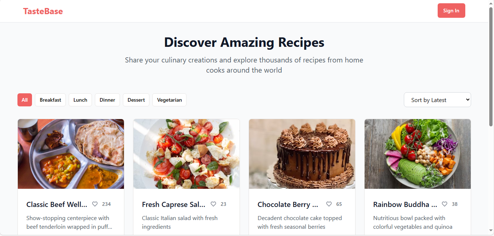
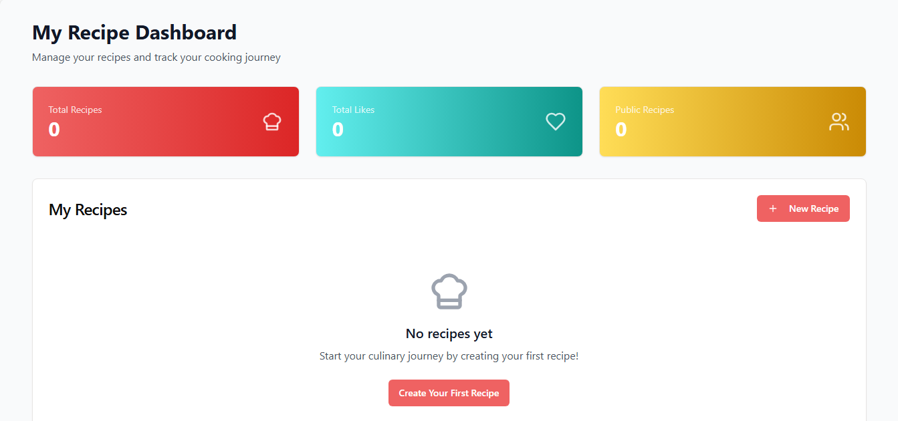

# TasteBase - Recipe Sharing Platform

<div align="center">


**A modern, full-stack recipe sharing and management platform**

[](https://reactjs.org/)
[](https://www.typescriptlang.org/)
[](https://expressjs.com/)
[](https://socket.io/)
[](https://tailwindcss.com/)

[Live Demo](https://final-project-wqlc.onrender.com/) • [Documentation](./docs/) • [API Reference](./docs/api-documentation.md) • [Video Example](https://www.loom.com/share/f28af19429494ad499cd8bd2220ba316?sid=80a3efca-2897-4947-84df-57168d9fb97a)

</div>

## Features

### 🔐 **User Authentication**
- Secure JWT-based authentication
- User registration and login
- Password hashing with bcrypt
- Protected routes and sessions

### 📚 **Recipe Management**
- Create, edit, and delete recipes
- Rich recipe forms with validation
- Image support and tag categorization
- Privacy settings (public/private)
- Recipe export functionality (text & print)

### 🔍 **Discovery & Search**
- Advanced search across recipes
- Category filtering (breakfast, lunch, dinner, dessert, vegetarian)
- Sorting by popularity, date, cook time
- Public recipe browsing

### 🌐 **Social Features**
- Like and share recipes
- Real-time updates with Socket.io
- Author attribution and profiles
- Community recipe feed

### 📱 **Modern UI/UX**
- Responsive design for all devices
- Dark/light theme support
- Accessible components with Radix UI
- Professional animations and interactions

### 🧪 **Quality Assurance**
- Comprehensive test suite (Jest + React Testing Library)
- TypeScript for type safety
- ESLint for code quality
- Professional error handling

# Images

## Landing page


## Login page


## Personal Dashboard


## Quick Start

### Prerequisites

- Node.js 18+ and npm
- Git (optional, for cloning)

### Installation

1. **Clone the repository** (or [download as ZIP](./VSCODE_SETUP.md))
   ```bash
   git clone https://github.com/AlphaC137/Final_Project
   cd tastebase
   ```

2. **Install dependencies**
   ```bash
   npm install
   ```

3. **Start the development server**
   ```bash
   npm run dev
   ```

4. **Open your browser**
   - Navigate to http://localhost:5000
   - Register an account or login with demo credentials

### Demo Credentials

```
Email: sarah@example.com
Password: password123
```

## Project Structure

```
tastebase/
├── 📁 client/               # Frontend React application
│   ├── 📁 src/
│   │   ├── 📁 components/   # Reusable UI components
│   │   ├── 📁 pages/        # Page components and routes
│   │   ├── 📁 hooks/        # Custom React hooks
│   │   ├── 📁 lib/          # Utilities and configurations
│   │   └── 📁 __tests__/    # Frontend test suites
├── 📁 server/              # Backend Express application
│   ├── 📁 __tests__/       # Backend test suites
│   ├── 📁 data/            # Mock data and fixtures
│   ├── 📁 middleware/      # Express middleware
│   ├── index.ts           # Server entry point
│   ├── routes.ts          # API route definitions
│   └── storage.ts         # Storage interface
├── 📁 shared/             # Shared TypeScript types
├── 📁 docs/               # Project documentation
├── package.json           # Dependencies and scripts
└── README.md              # This file
```

## 💻 Development

### Available Scripts

```bash
# Start development server (frontend + backend)
npm run dev

# Run test suite
npm test

# Run tests in watch mode
npm run test:watch

# Generate test coverage report
npm run test:coverage

# Build for production
npm run build

# Start production server
npm start

# Type checking
npm run check
```

### Development Workflow

1. **Make changes** to the codebase
2. **Tests run automatically** with file watching
3. **Hot reload** updates the browser instantly
4. **TypeScript** ensures type safety
5. **ESLint** maintains code quality

### Adding New Features

1. **Plan the feature** - Update `shared/schema.ts` with new types
2. **Backend first** - Add routes in `server/routes.ts`
3. **Frontend components** - Create UI in `client/src/components/`
4. **Pages and routing** - Add pages to `client/src/pages/`
5. **Write tests** - Add comprehensive tests
6. **Documentation** - Update relevant docs

## 🧪 Testing

### Backend Testing
- **API Endpoints**: Authentication, recipes, search
- **Authentication Flow**: JWT tokens, password hashing
- **Data Validation**: Zod schema validation
- **Error Handling**: Comprehensive error scenarios

### Frontend Testing
- **Components**: UI components and interactions
- **User Flows**: Registration, login, recipe management
- **Hooks**: Custom React hooks functionality
- **Integration**: End-to-end user scenarios

### Running Tests

```bash
# Run all tests once
npm test

# Watch mode for development
npm run test:watch

# Generate detailed coverage report
npm run test:coverage

# View coverage in browser
open coverage/lcov-report/index.html
```

## 📊 Tech Stack

### Frontend
- **React 18** - Modern React with hooks and concurrent features
- **TypeScript** - Type safety and enhanced developer experience
- **TailwindCSS** - Utility-first CSS framework
- **Radix UI** - Accessible component primitives
- **TanStack Query** - Server state management
- **React Hook Form** - Performant form handling
- **Wouter** - Lightweight routing
- **Socket.io Client** - Real-time communication

### Backend
- **Express.js** - Fast, unopinionated web framework
- **TypeScript** - Type-safe backend development
- **JWT + bcrypt** - Secure authentication
- **Socket.io** - Real-time bidirectional communication
- **Zod** - Runtime type validation
- **Jest + Supertest** - Backend testing

### Development Tools
- **Vite** - Fast build tool and dev server
- **ESLint** - Code linting and formatting
- **Jest** - Testing framework
- **React Testing Library** - Frontend testing utilities

## 🗄️ Database Integration

TasteBase is designed with a flexible storage interface:

- **Development**: In-memory storage with mock data
- **Production**: Complete MongoDB integration guide available
- **Extensible**: Easy to switch between different databases

See [MongoDB Integration Guide](./docs/mongodb-integration.md) for production setup.

## 📚 Documentation

### For Developers
- **[API Documentation](./docs/api-documentation.md)** - Complete endpoint reference
- **[Architecture Guide](./docs/architecture.md)** - System design and patterns
- **[Testing Guide](./docs/testing-guide.md)** - Testing strategies
- **[MongoDB Integration](./docs/mongodb-integration.md)** - Database setup

### For Users
- **[User Guide](./docs/user-guide.md)** - Application user manual
- **[Feature Overview](./docs/features.md)** - Detailed feature descriptions

### For Deployment
- **[VS Code Setup](./VSCODE_SETUP.md)** - Local development setup
- **[Deployment Guide](./docs/deployment.md)** - Production deployment
- **[Security Guide](./docs/security.md)** - Security best practices

## Deployment

### Quick Deploy to Replit
1. Fork this Repl or import from GitHub
2. Install dependencies: `npm install`
3. Start the server: `npm run dev`
4. Your app will be available at your Repl URL

### Production Deployment
Follow our comprehensive [Deployment Guide](./docs/deployment.md) for:
- Environment setup
- Database configuration
- Security hardening
- Performance optimization

## 🤝 Contributing

We welcome contributions! Please see our [Contributing Guide](./CONTRIBUTING.md) for:

- Code style guidelines
- Development workflow
- Testing requirements
- Pull request process

## 🔒 Security

TasteBase implements security best practices:

- **Authentication**: JWT tokens with secure expiration
- **Password Security**: bcrypt hashing with salt rounds
- **Input Validation**: Zod schema validation
- **Error Handling**: Secure error messages
- **CORS**: Proper cross-origin resource sharing

See [Security Guide](./docs/security.md) for details.

## 📈 Performance

- **Fast Loading**: Optimized bundle size and lazy loading
- **Efficient Caching**: TanStack Query cache management
- **Real-time Updates**: Socket.io with connection pooling
- **Responsive Design**: Mobile-first, accessible interface

## 🐛 Troubleshooting

### Common Issues

**Port already in use?**
```bash
# Kill process on port 5000
npx kill-port 5000
```

**Dependencies issues?**
```bash
# Clear cache and reinstall
rm -rf node_modules package-lock.json
npm cache clean --force
npm install
```

**TypeScript errors?**
```bash
# Restart TypeScript server in VS Code
Ctrl+Shift+P → "TypeScript: Restart TS Server"
```

See [VS Code Setup Guide](./VSCODE_SETUP.md) for more troubleshooting.

## License

This project is licensed under the MIT License - see the [LICENSE](./LICENSE) file for details.

## 👥 Acknowledgments

- [Radix UI](https://radix-ui.com) for accessible component primitives
- [TailwindCSS](https://tailwindcss.com) for utility-first styling
- [Unsplash](https://unsplash.com) for recipe images
- The open-source community for amazing tools and libraries

---

<div align="center">

**Built with coffee by Sydwell Lebeloane**

[Report Bug](mailto:support@tastebase.com) • [Request Feature](mailto:features@tastebase.com) • [Documentation](./docs/)

</div>
